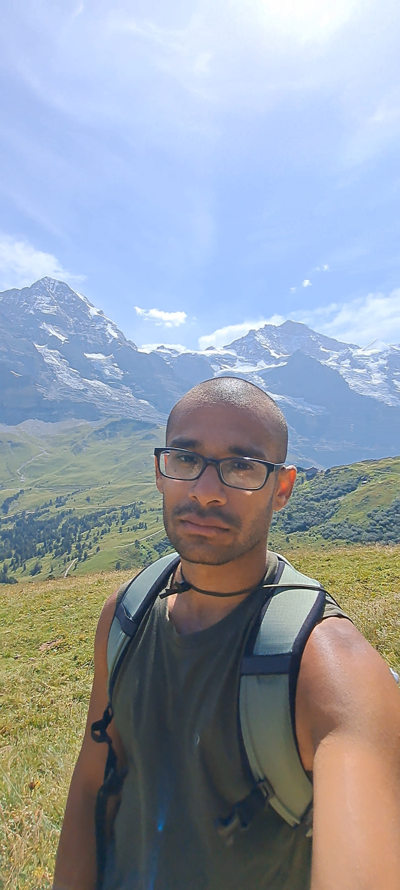

<!-- Top-right menu -->

  <a href="/CV_TS_Sept_2025.pdf">CV</a>

<!-- Table layout: Photo left, text right -->
|  | 

**Link to CV:** [Download CV (PDF)](CV_TS_Sept_2025.pdf)

## 🔹 About Me

Hi! I'm Tanmay Singal! I'm a quantum computing researcher based at the University of Cologne with David Gross ([link](https://qi.uni-koeln.de/)). Before Cologne, I worked as a postdoc with Dariusz Chruściński in UMK, Torun ([link](https://damsi.umk.pl/en/centre/quantum-entanglement-and-the-dynamics-of-open-quantum-systems/)), Michal Oszmaniec in CFT Warsaw ([link](https://quantin.pl/team/)) and Huangjun Zhu ([link](https://phys.fudan.edu.cn/13/75/c7605a136053/page.htm)) in Fudan University, Shanghai. I completed my PhD from the Institute of Mathematical Sciences, Chennai ([link](https://www.imsc.res.in/)), India in 2016 under the guidance of Sibasish Ghosh.

## 🔹 Research Areas

- My work is more on the theoretical side, focusing on the mathematical aspects of quantum computing. I routinely use group theory, representation theory, concentration of measure, random matrix theory, and linear algebra.  
- I also work on quantum algorithms and classical simulation of quantum random sampling experiments.  
- I have worked in certification and single-shot quantum state discrimination.

## 🔹 Other Interests

Apart from research, I enjoy hiking, running, swimming, and practicing calisthenics. I also enjoy reading.

## 🔹 Contact: Feel Free to Get in Touch!

- ✉️ Email: tanmaysingal(at)gmail(dot)com
|
