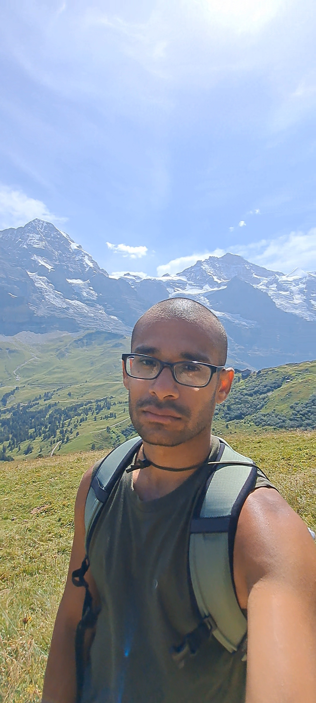

<!-- Top-right menu -->

  <a href="/index.md" style="margin-right: 20px;">Home</a>
  <a href="/publications.md" style="margin-right: 20px;">Publications</a>
  <a href="/CV_TS_Sept_2025.pdf">CV</a>

<!-- Main layout: photo left, text right -->

  <!-- Left: Circle photo -->
  

    
  

  <!-- Right: About Me content -->
  

    
Hello, I’m <strong>Tanmay Singal</strong>.

    
I'm a quantum computing researcher based in University of Cologne with David Gross (https://qi.uni-koeln.de/). Before being in Cologne, I worked as a postdoc with Dariusz Chruscinski in UMK, Torun (https://damsi.umk.pl/en/centre/quantum-entanglement-and-the-dynamics-of-open-quantum-systems/), Michal Oszmaniec in CFT Warsaw (https://quantin.pl/team/) and Huangjun Zhu (https://phys.fudan.edu.cn/13/75/c7605a136053/page.htm) in Fudan Univeristy, Shanghai. I completed my PhD. from the Institute of Mathematical Sciences, Chennai (https://www.imsc.res.in/), India in 2016 under the guidance of Sibasish Ghosh. 

    
Research Interests:-  My work is more on the theoretical side. A lot of my work deals with the mathematical aspects of quantum computing. The tools I routinely use in my work involve group theory, representation theory, concentration of measure, random matrix theory, and, of course, a lot of linear algebra! I also work in quantum algorithms and classical simulation of quantum random sampling experiments. I have also worked in certification and and single-shot quanutm state discrimination. 

    
Other Interests: Hiking, reading, traveling, and exploring new technologies.

    
Contact: tanmaysingal(at)gmail(dot)com

  

